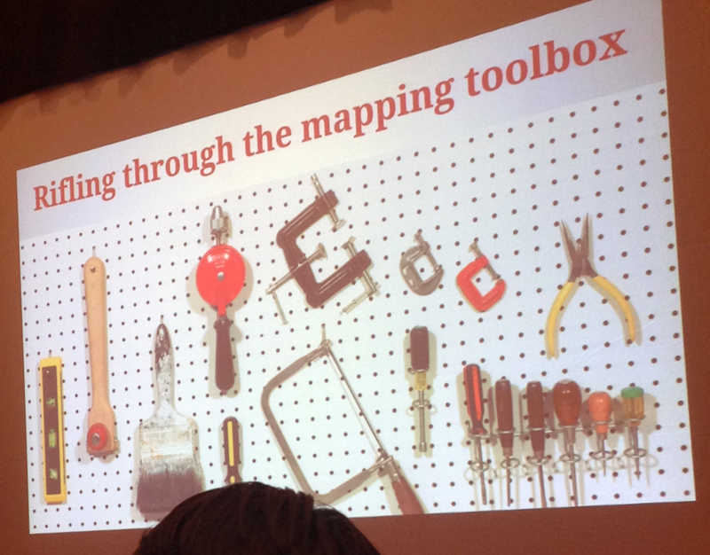
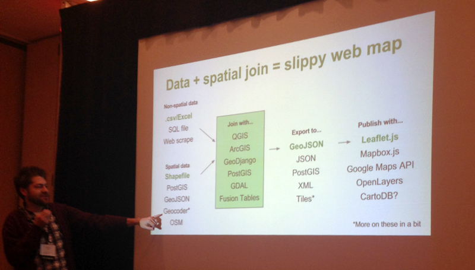
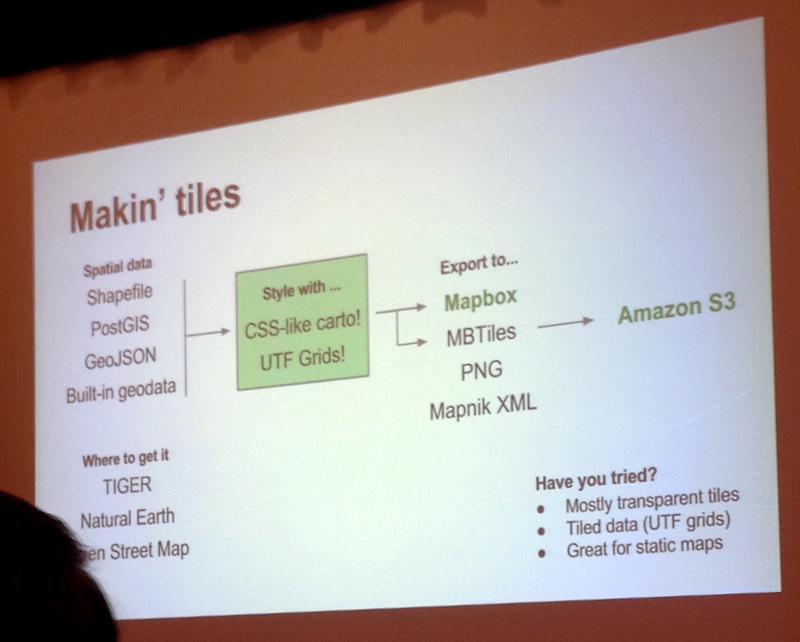

#Rifling through the mapping toolbox

####Speakers:
* **[Ryan McNeill](https://twitter.com/McNeill_Reuters)**, *data journalist, Reuters*
* **[Michael Corey](https://twitter.com/mikejcorey)**, *senior news applications developer, The Center for Investigative Reporting*

####Notes
Opening example: Shapefile of the Florida coastline
Goal: Create a 1-mile buffer zone
Problem: The shape was way too complex; attempts became too memory intensive.

"What you need is a tool to solve the problem. No time for obsession."

Think about the end product when choosing the best tools to get there.

When using a geocoding tool, read the TOS:

* Required to use Lat/Lng on their map?
* Are you allowed to cache?
* Is there a rate limit?

(the last two are often at odds)

Some examples:

* [Google Geocoding API](https://developers.google.com/maps/documentation/geocoding/)
* [ArcGIS Online](http://www.esri.com/software/arcgis/arcgisonline)
* [Oatmeal (for Python)](https://pypi.python.org/pypi/python-omgeo) or [Ruby Geocoder](http://www.rubygeocoder.com/)

Use Caution:

* Doublecheck your results
* Lat/Lng may be wrong
* Check the precision field

Example: [Reuters' Ammonium Nitrate Map](http://www.reuters.com/article/interactive/idUSBRE94L19020130522?view=large)

* Hand-checked data
* Had to eliminate some that couldn't be confirmed
* Result: Undercounted facilities, but low risk of misidentifying

(Still did, due to old data provided by states)

Vector Web Map tools:

* [GeoJSON](http://geojson.org/)
* [TopoJSON](https://github.com/mbostock/topojson)
* [D3.js](http://d3js.org/)
* [Kartograph](http://kartograph.org/)

It's hard to find data that crosses international borders.

Example: [CIR's drug trafficking map](http://static.apps.cironline.org/border-seizures/)

Question: Where is a good place to start? Answer: [TileMill](https://www.mapbox.com/tilemill/)

Question: How can you use a huge dataset? Answer: Narrow it down. Clean the data. Use the accuracy field. Throw out P.O. Boxes and similar. Test if returned location and actual location are in the same county.

[Link to slides](https://docs.google.com/presentation/d/1IbN8EM1VSXcDz7_kSgY5ZBi13EqCogwiXBWTdOD4su8/)

[IRE link](http://ire.org/events-and-training/event/973/1189/)

####More slides

