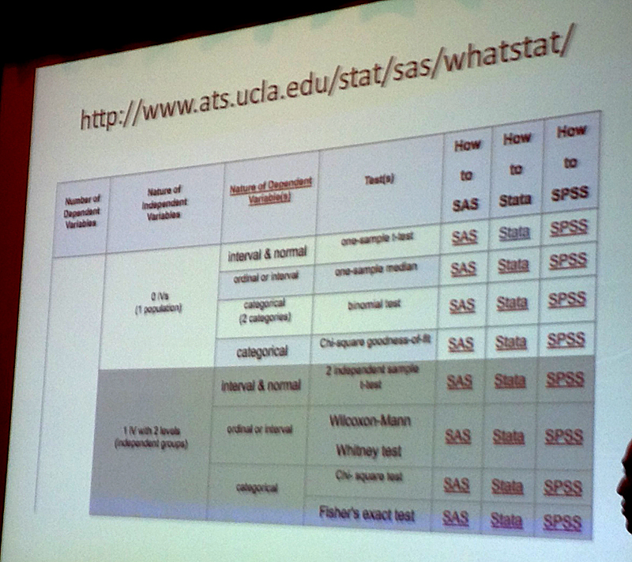

#Enhance your stories with statistics

####Speakers:
* **[Steven Rich][9873-001]**, *database editor, The Washington Post*
* **[Rob Barry][9873-002]**, *investigative reporter, The Wall Street Journal*

[9873-001]: https://twitter.com/dataeditor
[9873-002]: https://twitter.com/rob_barry

####Notes

"We're journalists, not scientists."

Don't overthink. Mostly you need to:

* Count
* Sum
* Group
* Think

Seek the middle. It often describes the group. Check the mean vs. the median.

Also quartiles and correlation. *Correlation does not equal causation.*

Histograms are powerful. A visualization of distribution. You can eyeball mean vs. median.

Checking fortuitous stock trades, using a Monte Carlo simulation to see if actual profit was likely.

Fisher's Exact Test is useful for small sample sizes and categorical data.

Linear regression is for continuous data. Logistic regression is for binary data.

Tips to help avoid mistakes:

* Try to prove yourself wrong
* Run it by your targets
* Ask an expert (in the newsroom or not)
* Make sure you're using the right test

Question: How to translate stats to English (for a story)? Answer: Think thoroughly about what you're actually saying to boil it down. Use a methodology box/page/etc. to explain in detail.

[IRE link](http://ire.org/events-and-training/event/973/1185/)

####More slides
