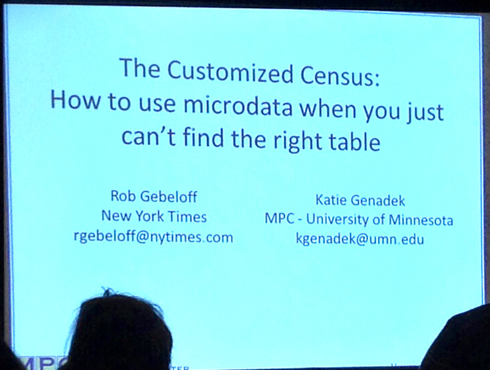

#The customized Census

### How to use microdata when you just can't find the right table

####Speakers:

* **[Robert Gebeloff][6764-001]**, *data journalism specialist, The New York Times*
* **[Katie Genadek][6764-002]**, *director of outreach and dissemination, IPUMS*

[6764-001]: https://twitter.com/gebeloffnyt
[6764-002]: http://usa.ipums.org/usa/cite.shtml

####Notes

Census microdata from [IPUMS](https://www.ipums.org/) gives you the full range of responses, some custom tables but there's also some data supression.

IPUMS is the Integrated Public Use Microdata Series.

It's standardized across years. Has documentation. And includes the American Community Survey from 2000-2012.

Example: How many Italian barbers are there?

You can find a total for the country. Then you can narrow it down to a particular state and gender.

But check out the confidence interval and raw numbers.

Another example: How many people might be affected by the ACA/Medicaid Gap in states that aren't expanding it.

Problem: Had to translate the census poverty levels to the Medicaid poverty levels. Also had to exclude unauthorized immigrants (might be included in census, but wouldn't be covered by Medicaid even if expanded).

**[Presentation exercise (PDF)](https://www.dropbox.com/s/wwmhsoj1qsqo3r7/Census.pdf)**

[Notes from Justin Myers](https://github.com/myersjustinc/nicar14-notes/blob/fa7dbe7b3d999a97c9a191fcf8ed9ff16f01f661/20140227_1400-the_customized_census.txt)

[IRE link](http://ire.org/events-and-training/event/973/1139/)