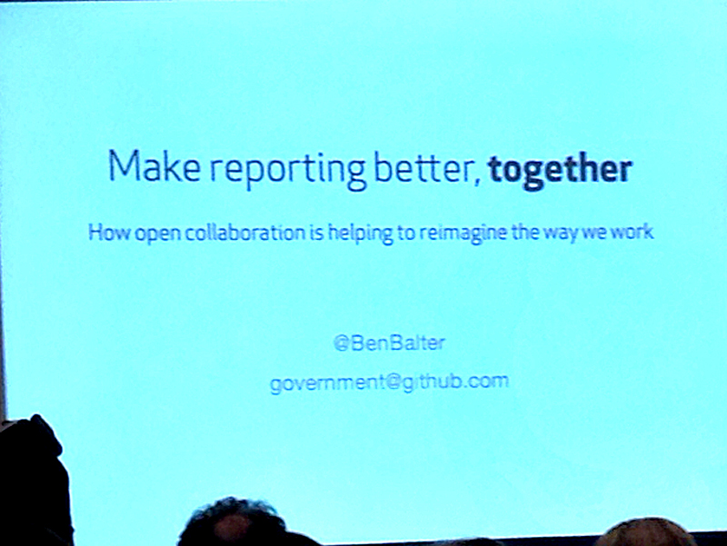

#Make reporting better, together

###Collaborative reporting with GitHub

####Speakers:
* **[Ben Balter](https://twitter.com/BenBalter)**, *government evangelist, GitHub*

####Notes

Initial reporter's tool? Typewriter. Not collaborative. I produce, then send.

It's the same with email.

Open does not equal public. Open means open collaboration.

There's a continuum of stakeholders (not just developers), and all can/should be involved in creating the thing.

Follow the presentation. It's awesome.

**[Presentation Link](http://ben.balter.com/make-reporting-better-together/#/title)**

[IRE link](http://ire.org/events-and-training/event/973/1118/)